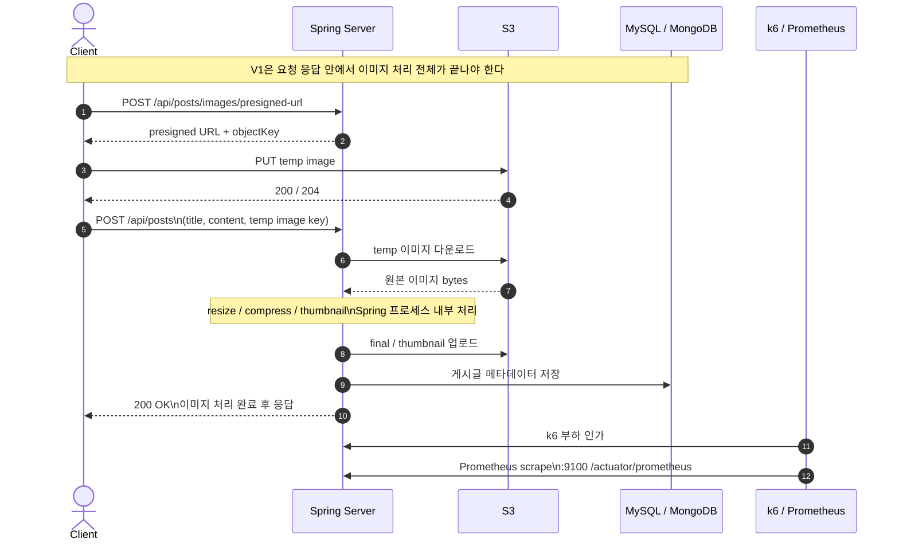
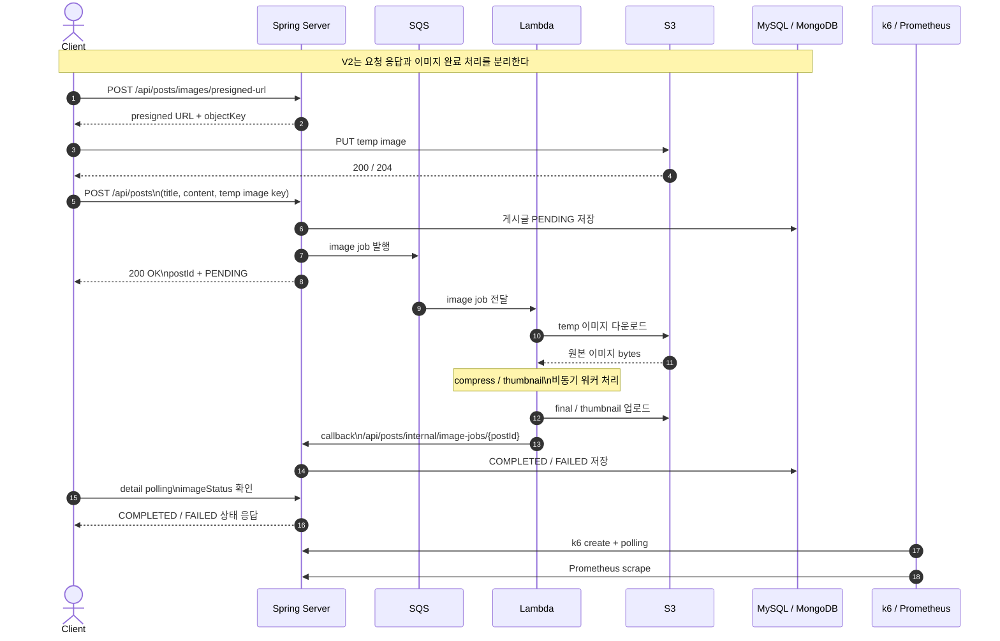

# Image Pipeline V1 vs V2 Sequence Diagrams

## V1 Sync

## V2 Async

## Reading Guide

- `V1`: 응답시간 안에 이미지 처리 비용이 직접 포함된다.
- `V2`: 요청 응답은 빨라지지만, 완료 지연은 비동기 처리 구간으로 이동한다.
- 두 버전 모두 실제 시작점은 `presigned URL 발급 -> temp 업로드 -> create`다.
- 포트폴리오 본문 비교는 `POST /posts p95`, `API error rate`를 주지표로 사용한다.
- `image completion latency`와 observability는 구조 해석용 보조 지표다.
