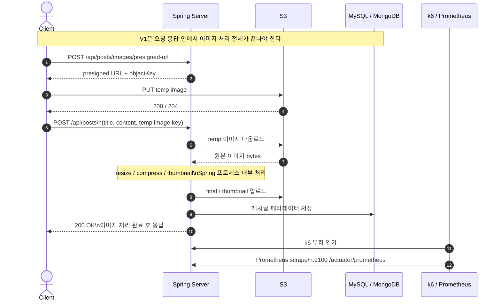

# V1 Sync Current Architecture

## Overview

`V1`의 핵심은 이미지 처리 비용이 전부 요청 응답 안에 들어 있다는 점이다.
실제 시작 플로우는 `presigned URL 발급 -> temp 업로드 -> POST /api/posts`이고,
마지막 `POST /api/posts` 한 번 안에서 아래가 모두 끝나야 응답이 나간다.

- temp 업로드용 presigned URL 발급
- temp 이미지 업로드
- temp 이미지 참조 검증
- 원본 이미지 다운로드
- 압축 / 리사이즈
- 썸네일 생성
- final / thumbnail 업로드
- 게시글 메타데이터 저장

그래서 `V1`의 응답시간은 곧 이미지 처리시간을 직접 포함한다.

## Flow-Centric Diagram

- draw.io 원본: `docs/experiments/diagrams/v1-sync-current-architecture.drawio`
- Mermaid 버전: 아래 `Sequence Diagram`

이 다이어그램은 아래 관점에 맞춰 그렸다.

- 어떤 요청이 들어오는가
- Spring이 어떤 외부 시스템과 순서대로 통신하는가
- 언제 최종 응답이 나가는가
- 관측과 테스트는 어디서 붙는가

## Sequence Diagram

## Request / Response Flow

1. Client가 `POST /api/posts/images/presigned-url`로 temp 업로드용 URL과 object key를 받는다.
2. Client가 S3에 temp 이미지를 직접 업로드한다.
3. Client가 `POST /api/posts`를 호출한다.
4. Spring은 요청 본문에 들어 있는 temp image key를 검증한다.
5. Spring이 S3에서 temp 이미지를 다운로드한다.
6. Spring 프로세스 안에서 압축과 썸네일 생성을 수행한다.
7. Spring이 S3에 final 이미지와 thumbnail 이미지를 업로드한다.
8. Spring이 MySQL / MongoDB에 게시글 메타데이터를 저장한다.
9. 모든 단계가 끝난 뒤에야 Client에게 응답을 돌려준다.

즉, 요청 1건의 latency 안에 이미지 처리 전체가 묶인다.

## Communication Boundaries

- Client ↔ Spring
  - `POST /api/posts`
  - 응답은 이미지 처리 완료 후 반환
- Spring ↔ S3
  - temp 다운로드
  - final / thumbnail 업로드
- Spring ↔ MySQL / MongoDB / Redis
  - 게시글 저장
  - 읽기/캐시 보조
- k6 ↔ Spring
  - presigned URL 발급
  - temp 업로드
  - `POST /api/posts`
- Prometheus ↔ App EC2
  - `:9100`
  - `/actuator/prometheus`

## Deployment Shape

현재 실험 환경은 완전한 3대 분리 구조가 아니다.

- App EC2 1대
  - Spring Boot
  - MySQL Docker
  - MongoDB Docker
  - Redis Docker
  - `node_exporter`
- k6 EC2 1대
  - `k6`
  - Prometheus Docker
  - Grafana Docker

의도는 단순하다.

- 부하 발생기는 앱과 분리
- 앱은 단일 인스턴스로 고정
- 관측은 보조 수단이므로 k6 EC2에 동거

## What The User Feels

사용자 입장에서는 `POST /api/posts`가 이미지 처리 완료를 기다린다.

- 장점
  - 응답 시점에 이미 게시글 이미지가 최종 상태다
- 단점
  - 이미지가 크거나 동시 요청이 늘면 바로 응답시간이 늘어난다
  - 병목이 오면 API 에러율도 같이 오른다

## Metrics Focus

1차 비교 지표:

- `k6` 기준 `POST /posts p95`
- `k6` 기준 `API error rate`

보조 해석:

- Prometheus / Grafana
- Spring CPU
- JVM heap
- scrape health

## Related Docs

- 결과 요약: `docs/experiments/results/exp-v1-sync/summary.md`
- 상세 리포트: `docs/experiments/results/exp-v1-sync/v1-baseline-report-2026-04-04.md`
- 테스트 절차: `docs/experiments/image-pipeline-test-flow.md`
