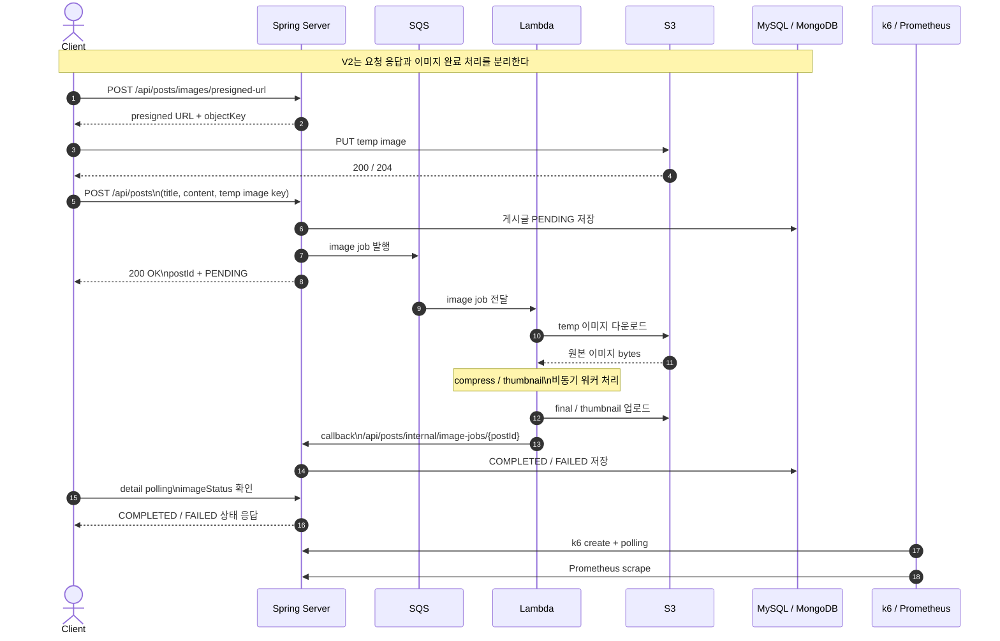

# V2 Async Current Architecture

## Overview

`V2`의 핵심은 요청 경로와 이미지 처리 경로를 분리한 것이다.
실제 시작 플로우는 `presigned URL 발급 -> temp 업로드 -> POST /api/posts`이고,
`POST /api/posts`는 게시글을 `PENDING` 상태로 저장하고 SQS에 작업을 넣은 뒤 바로 응답한다.
실제 이미지 압축과 썸네일 생성은 Lambda가 뒤에서 처리한다.

즉 `V2`는 다음 두 시간을 분리해서 봐야 한다.

- 요청 응답 시간: `POST /api/posts`
- 이미지 완료 시간: async completion latency

## Flow-Centric Diagram

- draw.io 원본: `docs/experiments/diagrams/v2-async-current-architecture.drawio`
- Mermaid 버전: 아래 `Sequence Diagram`

이 다이어그램은 아래 관점에 맞춰 그렸다.

- 요청을 받은 직후 어디까지 동기 처리하는가
- 어디서 큐로 넘기는가
- Lambda가 어떤 순서로 처리하는가
- 어떤 callback으로 상태를 완료시키는가

## Sequence Diagram

## Request / Response Flow

1. Client가 `POST /api/posts/images/presigned-url`로 temp 업로드용 URL과 object key를 받는다.
2. Client가 S3에 temp 이미지를 직접 업로드한다.
3. Client가 `POST /api/posts`를 호출한다.
4. Spring은 temp image key를 검증한다.
5. Spring은 게시글을 `PENDING` 상태로 저장한다.
6. Spring은 SQS에 image job 메시지를 발행한다.
7. Spring은 Client에게 즉시 응답한다.
8. Lambda가 SQS 메시지를 소비한다.
9. Lambda가 S3에서 temp 이미지를 다운로드한다.
10. Lambda가 압축 / 썸네일 생성을 수행한다.
11. Lambda가 final / thumbnail 이미지를 S3에 업로드한다.
12. Lambda가 Spring callback endpoint를 호출한다.
13. Spring이 게시글 상태를 `COMPLETED` 또는 `FAILED`로 갱신한다.
14. Client는 `GET /api/posts/{postId}` polling으로 완료 상태를 확인한다.

즉, 요청 응답은 빨라지지만 이미지 완료는 뒤에서 따로 진행된다.

## Communication Boundaries

- Client ↔ Spring
  - `POST /api/posts`
  - 즉시 응답
  - 이후 상세조회 polling으로 `imageStatus` 확인 가능
- Spring ↔ SQS
  - async image job publish
- SQS ↔ Lambda
  - event source mapping 기반 소비
- Lambda ↔ S3
  - temp 다운로드
  - final / thumbnail 업로드
- Lambda ↔ Spring
  - `/api/posts/internal/image-jobs/{postId}` callback
- Spring ↔ MySQL / MongoDB / Redis
  - 게시글 상태 저장 / 조회
- k6 ↔ Spring
  - create 요청 후 상세조회 polling

## Deployment Shape

현재 실험 환경은 아래처럼 구성되어 있다.

- App EC2 1대
  - Spring Boot
  - MySQL Docker
  - MongoDB Docker
  - Redis Docker
  - `node_exporter`
- k6 EC2 1대
  - `k6`
  - Prometheus Docker
  - Grafana Docker
- AWS managed components
  - SQS main queue
  - image processor Lambda

즉 `V1`과 App / k6 배치는 같고, 이미지 처리 워커만 EC2 밖으로 빠졌다.

## What The User Feels

사용자 입장에서는 `POST /api/posts` 응답이 훨씬 빨라진다.
대신 응답 직후 이미지는 아직 `PENDING`일 수 있다.

- 장점
  - 요청 경로 p95와 에러율이 크게 줄어든다
- 단점
  - 이미지 완료까지 tail latency가 별도로 생긴다
  - 큐와 워커 상태를 같이 봐야 한다

## Metrics Focus

1차 비교 지표:

- `k6` 기준 `POST /posts p95`
- `k6` 기준 `API error rate`

보조 지표:

- `k6` 기준 `image completion latency p95`
- Prometheus / Grafana
- `docs/experiments/results/exp-v2-async/metrics/queue-*.json`

포트폴리오 본문 비교표에는 `k6` 기준 수치를 우선 사용한다.

## Related Docs

- 결과 요약: `docs/experiments/results/exp-v2-async/summary.md`
- 상세 리포트: `docs/experiments/results/exp-v2-async/v2-baseline-report-2026-04-04.md`
- 테스트 절차: `docs/experiments/image-pipeline-test-flow.md`
