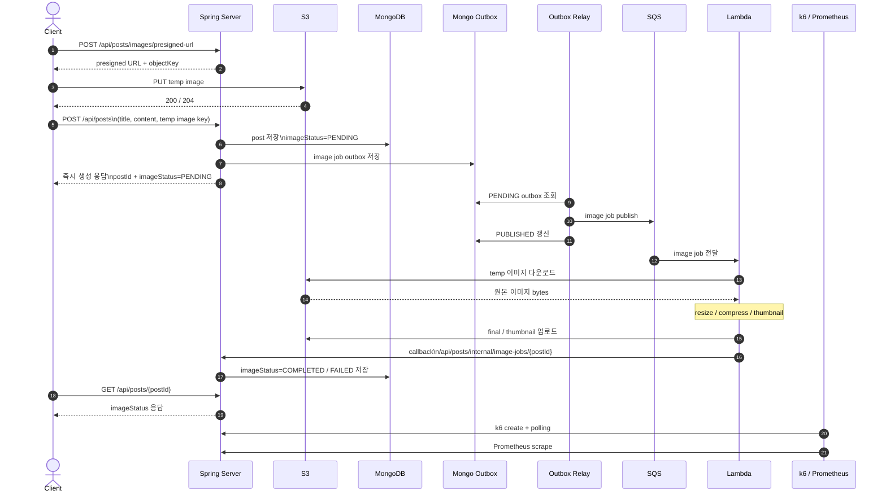

# V3 Outbox Current Architecture

## Overview

`V3`의 핵심은 `V2`의 direct publish를 `outbox + relay`로 바꾼 것이다.
사용자 시작 플로우는 여전히 `presigned URL 발급 -> temp 업로드 -> POST /api/posts`다.
차이는 `POST /api/posts` 내부에서 게시글 `imageStatus=PENDING` 저장과 outbox 기록을 함께 남기고,
별도 relay가 outbox를 읽어 SQS로 발행한다는 점이다.

즉 `V3`는 다음 세 흐름으로 나뉜다.

- 요청 응답 시간: `POST /api/posts`
- 발행 보장 흐름: outbox record -> relay publish
- 이미지 완료 시간: async completion latency

## Flow-Centric Diagram

- draw.io 원본: `docs/experiments/diagrams/v3-outbox-current-architecture.drawio`

이 다이어그램은 아래 관점에 맞춰 그렸다.

- 어디까지가 사용자 요청 경로인가
- post 저장과 outbox 저장이 어디서 같이 묶이는가
- relay가 어떤 시점에 SQS로 publish 하는가
- Lambda callback 이후 어떤 상태 조회로 완료를 확인하는가

## Sequence Diagram

## Request / Response Flow

1. Client가 `POST /api/posts/images/presigned-url`로 temp 업로드용 URL과 object key를 받는다.
2. Client가 S3에 temp 이미지를 직접 업로드한다.
3. Client가 `POST /api/posts`를 호출한다.
4. Spring은 temp image key를 검증한다.
5. Spring은 게시글을 `imageStatus=PENDING`으로 저장한다.
6. Spring은 같은 저장 단위 안에서 outbox record를 함께 저장한다.
7. Spring은 Client에게 즉시 응답한다.
8. Outbox relay가 `PENDING` outbox를 읽어 SQS에 발행한다.
9. 발행 성공 후 outbox 상태를 `PUBLISHED`로 바꾼다.
10. Lambda가 SQS 메시지를 소비해 이미지를 처리한다.
11. Lambda가 callback endpoint를 호출한다.
12. Spring이 게시글의 `imageStatus`를 `COMPLETED` 또는 `FAILED`로 갱신한다.
13. Client는 `GET /api/posts/{postId}` polling으로 완료 상태를 확인한다.

## Metrics Focus

1차 비교 지표:

- `k6` 기준 `POST /posts p95`
- `k6` 기준 `API error rate`

보조 지표:

- `k6` 기준 `image completion latency p95`
- `pending outbox count`
- `orphan pending post count`
- `docs/experiments/results/exp-v3-outbox/metrics/queue-*.json`
- `docs/experiments/results/exp-v3-outbox/metrics/outbox-*.json`

## Scope Note

현재 기준선은 single app node에서 수집한 baseline이다.

- 이번 단계의 핵심은 `direct publish -> outbox + relay` 구조 차이 검증
- multi-ASG까지 확장하려면 relay가 같은 outbox row를 여러 노드가 동시에 집지 않도록 원자적 claim이 필요하다
- 현재 코드에는 그 claim 로직을 추가했지만, 실제 multi-ASG 재실험은 shared data 계층과 ALB callback 경로를 분리한 뒤 다시 수행해야 한다
