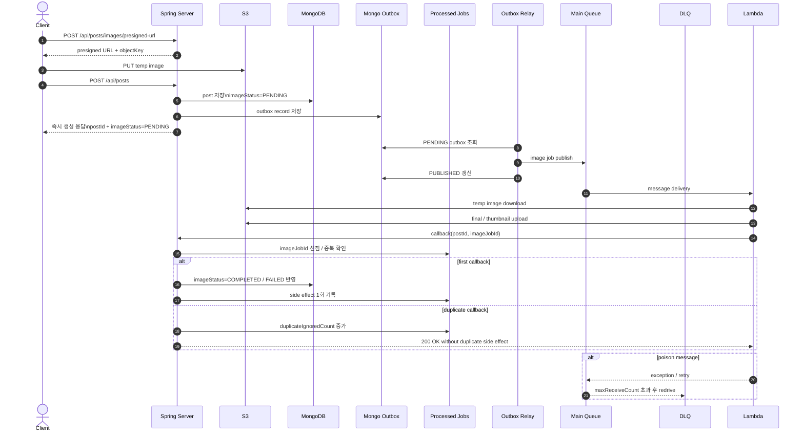

# V4 Idempotent + DLQ Current Architecture

## Overview

`V4`는 `V3`의 `outbox + relay` 구조를 유지하면서,
callback 소비 지점에 `processed jobs` 저장소를 추가하고,
SQS `DLQ`를 연결한 단계다.

즉 `V4`의 핵심은 두 가지다.

- 같은 `imageJobId` callback이 여러 번 와도 side effect는 한 번만 반영
- 반복 실패 메시지는 main queue 바깥의 `DLQ`로 격리

## Flow-Centric Diagram

- draw.io 원본: `docs/experiments/diagrams/v4-idempotent-current-architecture.drawio`

## Sequence Diagram

## Request / Completion Flow

1. Client는 `presigned URL 발급 -> temp 업로드 -> POST /api/posts` 흐름으로 게시글을 생성한다.
2. Spring은 `post(imageStatus=PENDING) + outbox`를 함께 저장하고 즉시 응답한다.
3. Outbox relay가 main queue로 publish 한다.
4. Lambda가 이미지를 처리한 뒤 callback을 보낸다.
5. Spring은 `processed jobs` 컬렉션에서 `imageJobId`를 기준으로 중복 여부를 먼저 확인한다.
6. 첫 callback이면 게시글 상태를 갱신하고 `processed jobs`에 side effect 1회를 기록한다.
7. 같은 callback이 다시 오면 게시글 상태는 다시 바꾸지 않고 `duplicateIgnoredCount`만 증가시킨다.
8. poison message는 main queue 재시도 후 `DLQ`로 이동한다.

## Metrics Focus

1차 비교 지표:

- `k6` 기준 `POST /posts p95`
- `k6` 기준 `API error rate`

보조 지표:

- `k6` 기준 `image completion latency p95`
- `duplicate side effect count`
- `duplicate callback ignored count`
- `DLQ count`
- `docs/experiments/results/exp-v4-idempotent/metrics/*.json`
- `docs/experiments/results/exp-v4-idempotent/probes/*.json`
